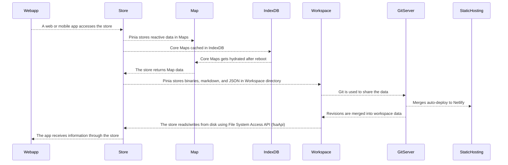

## Workspace Technical Details

* Requires a recent Chrome browser.
* The files never leave your computer.
* Easily used in Git projects.
* No tech skills or install required.
* Data stored and cached at multiple levels.
  * Pinia stores as the data access interface
  * ES6 Maps for reactive data
  * File System Access API for BLOBs, JSON, Markdown, and other data.
  * IndexDB to store the directory and files for better performance and persisting them across reboots.

### Workspace Data Flow

