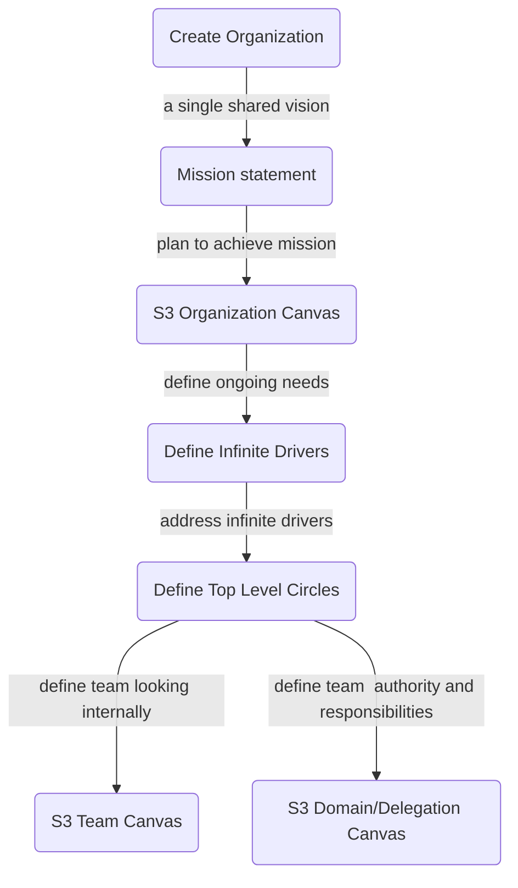

```mermaid
flowchart TD
  createOrg(Create Organization) -- a single shared vision --> mission(Mission statement)
  mission -- plan to achieve mission --> s3Org(S3 Organization Canvas)
  s3Org -- define ongoing needs --> infDrivers(Define Infinite Drivers)
  infDrivers -- address infinite drivers --> topCircles(Define Top Level Circles)
  topCircles -- define team looking internally ---> s3Team(S3 Team Canvas)
  topCircles --  define team  authority and responsibilities ---> s3Domain(S3 Domain/Delegation Canvas)
```
